# Milestone 1 Project: Sourdough Bakes

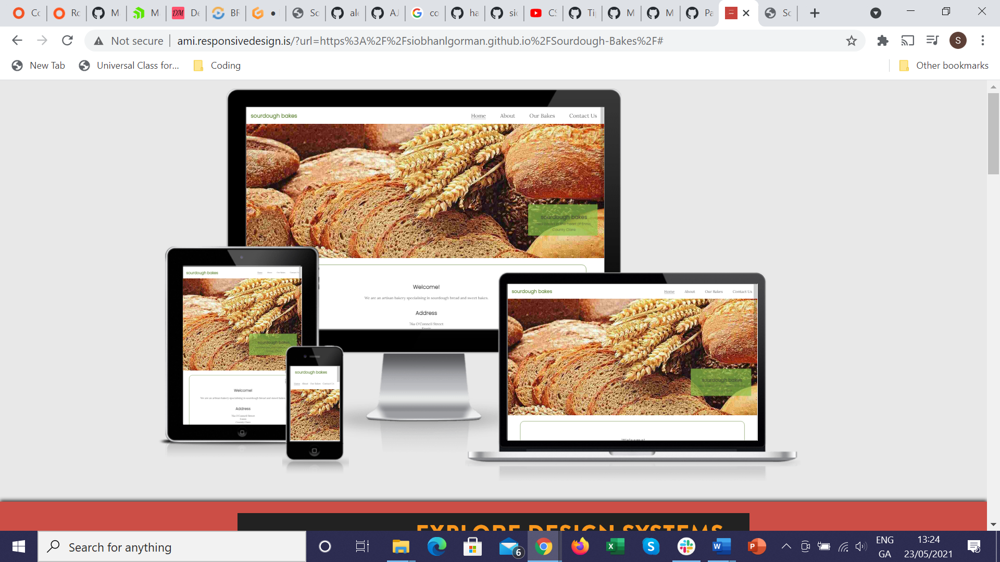

# Table Of Contents

- [Milestone 1 Project: Sourdough Bakes](#milestone-1-project--sourdough-bakes)
- [Introduction](#introduction)
- [User Goals and Stories](#user-goals-and-stories)
  * [Website Owner Business Goals](#website-owner-business-goals)
  * [User Goals](#user-goals)
  * [User Stories](#user-stories)
    + [As a business owner](#as-a-business-owner)
    + [As a general user of the website/customer](#as-a-general-user-of-the-website-customer)
    + [As a new user](#as-a-new-user)
- [Design of the website](#design-of-the-website)
  * [Wireframes](#wireframes)
  * [Fonts and Colour Scheme](#fonts-and-colour-scheme)
  * [Colours](#colours)
  * [Images](#images)
  * [Text](#text)
- [Features](#features)
  * [Existing Features](#existing-features)
    + [Navigation Bar](#navigation-bar)
    + [Footer](#footer)
    + [Back to Top Arrow](#back-to-top-arrow)
    + [Hero Image](#hero-image)
    + [Home Page](#home-page)
    + [About Page](#about-page)
    + [Our Bakes](#our-bakes)
    + [Contact Us](#contact-us)
  * [Future Features](#future-features)
- [Languages](#languages)
- [Technologies Used](#technologies-used)
- [Testing](#testing)
  * [Validation](#validation)
  * [Responsiveness](#responsiveness)
  * [User Stories Testing](#user-stories-testing)
  * [Manual Testing](#manual-testing)
  * [Deployment](#deployment)
  * [Bugs](#bugs)
  * [Unfixed Bugs](#unfixed-bugs)
  * [Credits](#credits)

# Introduction

This is a website for a fictional new bakery in Ennis, Co. Clare which specialises in baked goods made with sourdough leaven, using organic ingredients with no artificial additives. There are two ranges available bread and sweet bakes. The purpose of the website is to establish an online presence for the bakery to help increase the customer base.

The website targets people who want to purchase authentic sourdough baked goods which use organic ingredients and are freshly baked and are of high quality. The website will showcase the products available to the user and provide the essential information necessary to find the shop and be able to purchase.

# User Goals and Stories

## Website Owner Business Goals
As the website owner and owner of the bakery I want

* to deliver clear and easy to read information about my produce, the types offered and their price
* to encourage customers to visit the bakery to buy produce and offer them the opportunity to order and collect in store.
* to provide background information about why my produce is unique, healthy and good quality

## User Goals
As a user I want to

  * easily and intuitively navigate throughout the website
  * easily navigate between pages and return to home screen with one click
  * easily return to the navigation menu at the top of the page from the bottom of the page
  * be able to view the website and read all information on all screen sizes
  * view clear images throughout the site especially of the produce

## User Stories

### As a business owner
As the website and business owner I want to
  * create an online presence for our business
  * grow our local customer base
  * inform existing and new customers about our produce, location, opening hours
  * to provide a method of contact for customers to order produce or ask questions
  * to provide some introductory information on our USP which is authentic sourdough baked produce

### As a general user of the website/customer I want to 
* find out the location, opening hours and contact information 
* order some produce for collection
* find out more about sourdough
* view all the produce and relevant information about each item

### As a new user I want to
* find out what is different about the baked goods from this bakery compared to others

# Design of the website

The website is designed as four separate pages to enable the user to easily and precisely locate the information they are looking for without scrolling through a lot of information.  

From each page, the user can navigate directly to the produce page as it is a priority that the user can easily and quickly access this information.

With the navigation links in the header and and back to top arrow featuring on each page users are easily able to navigate their journey through the website. The contact page features a form where the users can request to reserve an item for instore collection. 

The ethos of the business is natural, organic healthier food and this is reflected in the green and neutral minimalist colour scheme and design. The design is kept clean and simple.

As the business goal is primamrily to showcase the produce available in store the site primarily features images rather than text in order to attract the user towards the produce. 

## Wireframes

The initial wireframes from the design phase can be seen here. All design features were implemented.

[https://github.com/siobhanlgorman/Sourdough-Bakes/tree/master/wireframes]

## Fonts and Colour Scheme

The fonts chosen were Poppins, sans serif for the Headings and logo and Lora for the body. They were chosen for the rounded and cosy feel they inspire in the viewer in this designer's opinion. Charcoal #3a3a3a was chosen for the font colour as it is less harsh to the users' eyes than black. However it was replaced by black #252525 in the text boxes overlaying the green background for better contrast and visibility against the green and the image.

## Colours
    
The colour theme is based around the colour of the business logo which is a green color: #5b8030. The other green shades on the site and the other green shades used were chosen to tone with this and keep to the overall theme of natural colours. The colour scheme is by choice minimalist, bright and neutral in keeping with the overall ethos of the business (natural, clean, organic, healthier food). The background is neutral white to keep contrast high enough with the green. 

## Images

Images were dowloaded from Pixabay and resized for the purpose of this website. The owners are credited in the Credits section.
The Images are styled with curved borders which is modern and gives a softer effect.

## Text
All text is written by the author.

# Features

## Existing Features

### Navigation Bar
* The navigation bar is visible on all pages. 
* The left side of navigation bar features the business logo which links to the home page from every page on the site as this is expected by the user.
* Links to each of the four pages of the site: Home, About, Our Bakes and Contact Us are conventionally positioned on the right as expected by the user. 
* The page link underlines when the page active on the website to indicate to the user where they are on the site.
* When the mouse hovers over a page link the background colour of the link turns green in keeping with the colour scheme of the site and provides easy navigation for the user.

### Footer
* The footer is visible on all pages
* left side has the business address and opening hours in a column, with logo which links to home page
* lined in a horizontal row from the right are four icons with links to the map address of the business and three social media accounts.
* the footer is reponsive with the address block sliding above the social media icons in the centre of the footer as the screen size reduces

### Back to Top Arrow
* Each page features an arrow at the bottom right which links back to the top of the page and is coloured green in keeping with the colour theme of the website.

### Hero Image
* Each page features a hero image with text overlay indicating the page title.

### Home Page
* The landing page features a hero image with a special zoom effect to catch the user's attention on arriving at the site.  The hero image also features the business name and a slogan to provoke a positive emotional reponse and encourage the user to continue on the site.
* This page features a short introduction to the business with the address and opening hours prominent as this information is considered a priority to users
* This page also features a snapshot of the produce with a link to the main Our Bakes page to encourage users to navigate there for more information.

### About Page

The About page has two sections, one with general information about the business and the other providing a short introduction to sourdough. The information is kept concise with short paragraphs so as not to overload the user with text and information but enough to answer initial questions and spark interest in the business and the products.

### Our Bakes

The Our Bakes page features a gallery of the range of products available in rows of two which collapse into a column of one at mobile phone screen size. The page also features a direct contact us here link which links to the form for users who would like further information on the products or to request an order. 

### Contact Us

The contact page features a form for user to enter name, email and a message, all required with a send button. Users are encouraged to request an order for collection in store with a mesage in the form. The message box can be enlarged by the user if required, both by mouse and touchscreen.

## Future Features

* A payment facility for users to order and pay for their purchase
* Links to recipes and links to more detailed information about sourdough
* Checkbox for offer to subscribe to a newsletter for information about events and offers

* As the product range expands a direct link from the home page snapshot of products section to each individial section on the Our Bakes page would improve user experience

# Languages

HTML (Hypertext Markup Language) was used to design the basic website and CSS (Cascading Style Sheets) to style the website and make it look appealing to the user.

# Technologies Used

[Balsamiq](https://balsamiq.com/) was used to create the wireframes.

[Google Fonts](https://fonts.google.com) was used for the fonts: Poppins and Lora.

[Fontawesome](https://fontawesome.com) was used for the social media icons, map link and the arrow back to top.

[Google maps](https://www.google.com/maps) was used to provide a map link.

# Testing

## Validation

* [HTML Validator](https://validator.w3.org/) was run at several points during the project and any small errors identified were fixed. At the final stage no errors or warnings were found
* [CSS Validator]https://validator.w3.org/) was run several times during the project and syntax errors were corrected. At the time of submission the css code succesfully passed the validator with no errors.
* Lighthouse in Chrome Developer Tools was used to check performance and picked up some early contrast errors in colour choice so colours were adjusted accordingly. No other significant errors were found.

## Responsiveness

The website was tested on Chrome, Mozilla, Edge and Safari browsers with no problems found.
The website was tested on numerous sized screens including Iphones 8 and X, Moto G8 plus, 15" laptop, 24" screen and Ipad and was found to respond to all sizes.
Chrome development tools was used throughout the design process to check responsiveness and breakpoints and adjustments were made.

## User Stories Testing

Each user story was tested as follows:

As a business owner I want to: 
* create an online presence for our business and grow our local customer base
* inform existing and new customers about our produce, location, opening hours
* to provide some introductory information on our USP which is authentic sourdough baked produce

These goals are achieved by the creation of a website with information about the business and the produce, clearly organised into relevant informative and separate pages.

* to provide a method of contact for customers to order produce or ask questions

This is achieved by the creation of a contact us form where users can submit their information and a message.

As a general user:
* I want to easily and intuitively navigate throughout the website, easily navigate between pages and return to home screen with one click

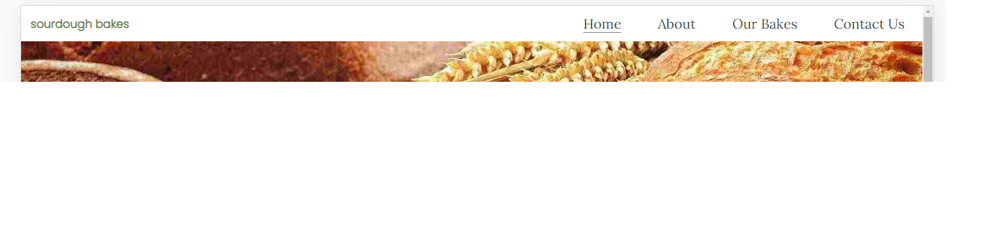
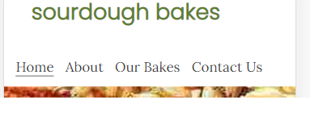

* easily return to the navigation menu at the top of the page from the bottom of the page

This story is satisfied by the 'back to top' arrow on the bottom right of each page

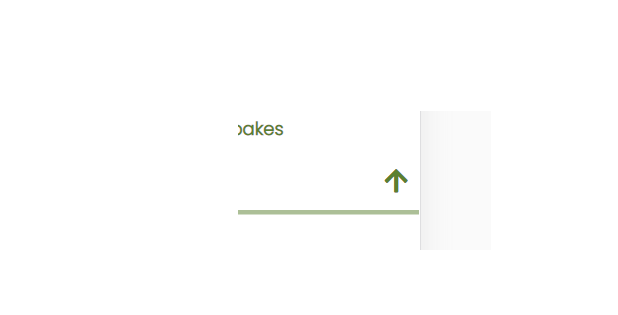

* be able to view the website and read all information on all screen sizes.

This story is implemented by the responsiveness to different screen sizes

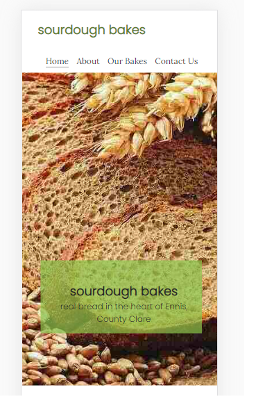
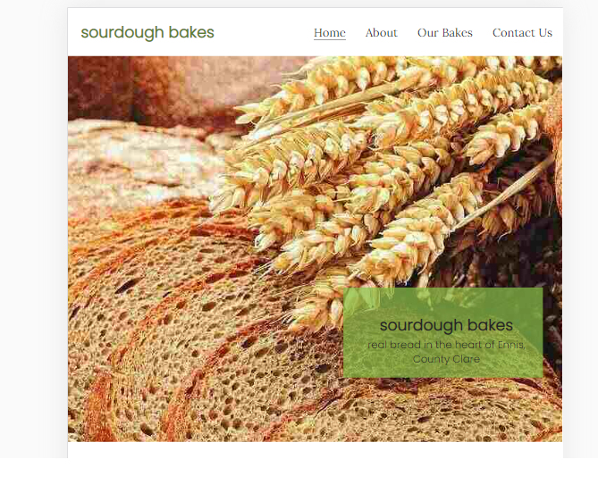

* view clear images throughout the site especially of the produce

This story is achieved by good quality images throughout the site and in particular the Our Bakes section. 

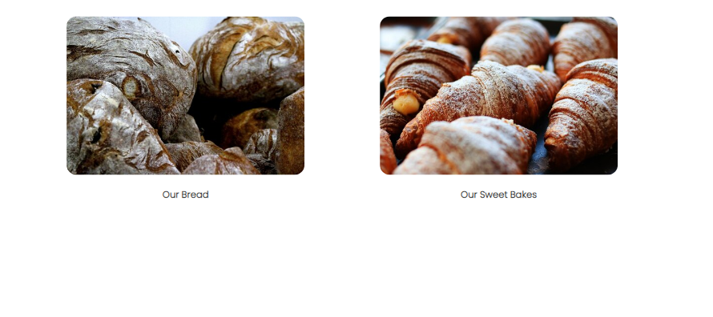

As a general user of the website/customer I want to 
* find out the location, opening hours and contact information 

This is implemented by the address block and map link in the footer on each page and a large text block on the home page. 

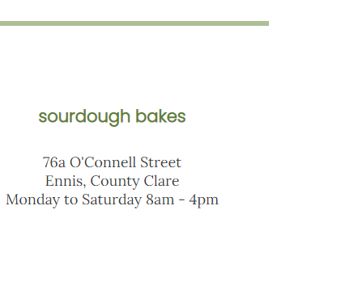

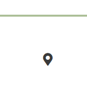

* order some produce for collection

This is implemented by the contact us form on the Contact page

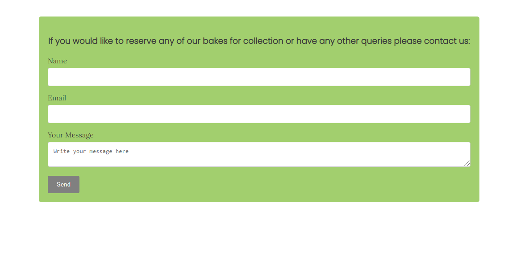

* find out more about sourdough

This is implemented by the About Sourdough section in the About page.

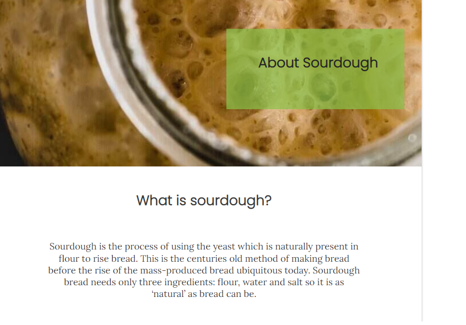

* view all the produce and relevant information about each item

This is implemented by a gallery of produce images in the Our Bakes page.

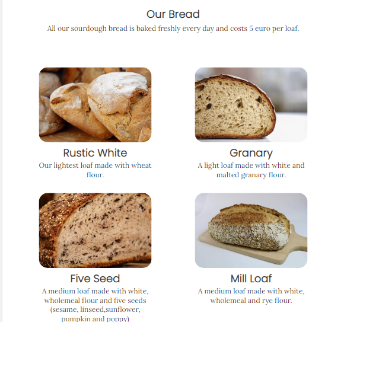

As a new user I want to

* find out what is different about the baked goods from this bakery compared to others

This goal is satisfied by the About section: About Us and About Sourdough.

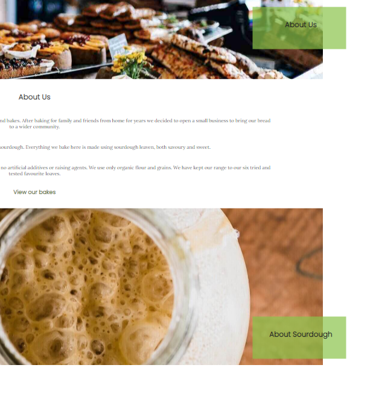

## Manual Testing

All links on all pages were checked
Form was submitted successfully to Code Institute form dump

The following links were all tested and passed:
* Navigation Bar: 
The logo links to the home page
The menu links to each of the four pages of the site: Home, About, Our Bakes and Contact Us
The active page link underlines when the page active on the website
The mouse hover action turns green over the menu page options
The navigation menu responds to decreasing screen size by moving under the logo and logo remains at the top

* Footer:

The business logo in the address block links to the home page.
The social media icons link to the three relevant social media accounts
The map link opens the location of the business in google maps

The footer is reponsive with the address block moves above the social media icons as the screen size reduces

* Back to Top Arrow
The arrow functions correctly linking back to the top 

* Hero Image landing page zoom
The zoom animation functions correctly on all screens.

* Home page links: the "View our breads" link links correctly to the Our Bakes page
* The two View Our Bakes links on the About Us page link correctly to the Our Bakes page.
* The Our Bakes page link to contact us here form page functions correctly
* The Contact Us form submits correctly to Code Institute form dump and will not submit without all fields beinig completed. The message box can be enlarged by the user on all screens

## Deployment

The site was deployed to GitHub pages. The steps taken to deploy are as follows:
1. Log in to Github
2. Navigate to siobhanlgorman/sourdoughbakes in the list of repositories
3. In the GitHub repository, navigate to the Settings tab
4. In Settings scroll down to GitHub pages which opens in a new page.
5. From the source section drop-down menu, select the Master Branch
6. Once the master branch has been selected, the page is automatically refreshed and a display indicates the successful deployment and the link to the address.
The link to the live website is here:
[https://siobhanlgorman.github.io/Sourdough-Bakes/]
 

## Bugs
The large image on every page were not zoomed to the best position on small screens. This image position was changed in media queries

It was difficult to get he navigation menu display to display responsively for all mobile phone screens. Although Chrome developer tools indicated that the menu was responsive it proved not to display correctly on some iPhones. The font size was adjusted in media queries.

## Unfixed Bugs

All bugs identified were fixed

## Credits

### Photos:

From [Pixabay](https://pixabay.com/)

1. bakery.jpg by Pexels from Pixabay
2. dough.jpg by Skitterphoto from Pixabay
3. granary2.jpg by Alexa from Pixabay 
4. five_seed3.jpg by Couleur from Pixabay
5. hero-image1.jpg by Aurelio Fox RJ from Pixabay
6. loaves.jpg by Michelle Still Creates from Pixabay
7. mill_loaf4.jpg by Mark Croemers from Pixabay
8. our_bread.jpg by Renee Olmsted from Pixabay
9. our_pastries.jpg by Photowill from Pixabay
10. rsz_1lemon.jpg by Photowill from Pixabay
11. rsz_banana3.jpg by Martina Rogusci from Pixabay
12. rsz_blueberry6.jpg by Sofia Livaren from Pixabay
13. rsz_carrot5.jpg by Varan Kilkarni from Pixabay
14. rsz_chocolate4.jpg by Kevin Petit from Pixabay
15. rsz_cinnamon1.jpg by Otto Norin from Pixabay
16. rustic_white1.jpg by Couleur from Pixabay
17. rye5.jpg by Plotnik 0l from from Pixabay
18. sourdough.jpg by Tom Bock1 from Pixabay
19. wholemeal6.jpg by Couleur from Pixabay

### Other: 

hero-image with cover-text and zoom animation effect was based on the Code Institute love running walkthrough project

flexbox approach from [freecodecamp](https://www.freecodecamp.org/) and [codercoder.com](https://coder-coder.com/display-divs-side-by-side/#grid-method)

Contact form adapted from [https://www.w3schools.com/howto/howto_css_contact_form.asp]

